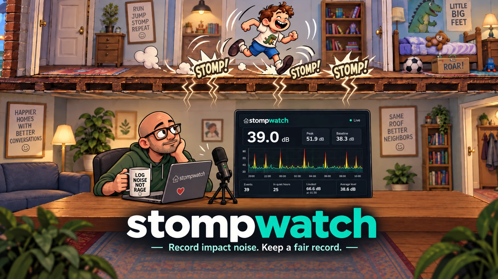
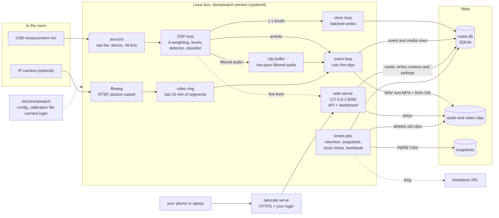

<p align="center">
  
</p>

# StompWatch

StompWatch measures impact noise from the apartment above: footsteps, running,
jumping, and things that drop on the floor. It runs all the time on a small
Linux box with a USB measurement microphone. It records the A-weighted sound
level every second, finds the loud events, and keeps a short filtered audio
clip of each one. An optional IP camera adds a video clip of each event. A
web dashboard shows the live level, the timeline, and the events, and lets
you mark each event as real or false.

The goal is a record that another person can check: calibrated levels, exact
times, a review decision on every event, and raw data that the program never
changes.

> **StompWatch is not a certified sound level meter.** It uses the IEC 61672
> A-weighting and a calibrated microphone, but no one has type-tested the
> whole chain. Treat its numbers as careful measurements, not as a legal
> certificate. It gives no legal advice.

## Why this exists

Impact noise from the apartment above is one of the hardest problems to fix
in shared housing. Running, jumping, and stomping travel straight through
the floor, often early in the morning or late into the evening, and they can
go on for months.

The usual steps are to talk to the neighbors, then to the landlord or the
property manager, then to the HOA or the condo board. Each of those steps
runs into the same wall sooner or later: "show us". "It was loud again" is
not evidence. A phone decibel app is not much better. It is not calibrated,
it cannot tell a footstep from a television, and anyone who wants to wave it
away can.

StompWatch was built to be that evidence. A calibrated measurement
microphone listens all day and writes down the level every second. Each thud
gets a time, a level, and a short clip, and you mark every event as real or
not before anyone else sees it. Ordinary household sounds, such as a
television or an air conditioner, set a simple detector off too, so most of
the classifier exists to tell those apart from a footstep.

Shared housing means hearing your neighbors, and that is fine. People walk,
cook, drop things, have children and guests, and live their lives. Nobody
should have to tiptoe in their own home, and StompWatch is not for policing
everyday life. Running and stomping for hours, day after day, is different.
It is not a normal part of shared living, and it affects the health and
well-being of the people below.

So StompWatch is for keeping a fair record, not for a feud. It measures, it
never changes what it measured, and the numbers speak for themselves. If
you, or someone you care about, lives under a running track, I hope it
helps.

## How it was built

StompWatch was not vibe coded. It was built by agentic engineering: AI
coding agents wrote much of the code, inside an engineering process, and I
made every decision. It took time and effort, and the trade-offs were
weighed one by one.

It was developed over two weekends. A calibrated measurement pipeline, a
detector, a classifier, video capture, a web dashboard, a security review,
and about 800 tests would have taken months not long ago. AI coding is
changing how fast projects like this can ship, and it is amazing to watch.
The speed does not come from skipping the engineering. It comes from
keeping the spec, the tests, and the decisions in human hands and letting
the agents do the typing.

- **A written spec came first.** [SPEC.md](SPEC.md) (about 1,500 lines) sets
  the requirements and the rules that must never break: raw audio capture,
  raw data that is never changed, and a speech filter that cannot be
  switched off. Every later change of direction is a numbered decision, 27
  so far, each with its reason and what was given up.
- **Tests came before code.** Each change started with a test that failed
  for the right reason. There are about 800 tests, and `verify-dsp` checks
  the measurement chain on the real hardware.
- **Trade-offs were weighed, not left at a default.** For example: where
  the speech filter sits (privacy against telling one impact from another),
  whether camera audio is recorded (off by default), how long the baseline
  window is, and which settings a phone may change at 2 a.m.
- **The detector was tuned on real data.** Its thresholds come from events
  that were reviewed and labeled by hand. False alarms from a television
  and an air conditioner changed the design.
- **It was reviewed before release.** Independent reviews covered security,
  privacy, and the docs against the code. Every finding was fixed, or
  documented where it cannot be fixed.

## Contents

- [Why this exists](#why-this-exists)
- [How it was built](#how-it-was-built)
- [What it does](#what-it-does)
- [Architecture](#architecture)
- [Tested hardware](#tested-hardware)
- [Quick start](#quick-start)
- [Set up the microphone](#set-up-the-microphone)
- [Add a camera](#add-a-camera)
- [Privacy and recording laws](#privacy-and-recording-laws)
- [The dashboard](#the-dashboard)
- [How it measures](#how-it-measures)
- [How it sorts events](#how-it-sorts-events)
- [Data, retention, and backups](#data-retention-and-backups)
- [Failures and alerts](#failures-and-alerts)
- [Security](#security)
- [Commands](#commands)
- [Development](#development)
- [Code layout](#code-layout)
- [Contributing](#contributing)
- [License](#license)

## What it does

- **Measures** LAeq and LAmax (Fast) every second, plus the low band
  (20-120 Hz, where footsteps are loud) and the high band (above 500 Hz,
  where voices and TV are loud).
- **Detects events.** An event starts when the level rises 15 dB (by
  default) over a rolling baseline of the quiet room.
- **Sorts events** into impact, running, jumping, stomping, steady sound,
  airborne sound (TV, voices), or unknown.
- **Keeps an audio clip** of each event, low-pass filtered before it touches
  the disk, so speech in the room cannot be understood.
- **Keeps a video clip** of each event from an RTSP camera, if you have one.
- **Lets you review** each event as verified, rejected, or unsure, with a
  note. The review is stored apart from the measurement.
- **Exports** a CSV of events and a PNG of the timeline for any night.
- **Watches itself.** Every capture gap, clock step, disk warning, and camera
  disconnect goes into a health log, and a dead-man's switch URL can alert
  you when the box stops.

## Architecture



- **One process.** The `stompwatch` service is one Go binary. It runs
  `arecord` and, with a camera, `ffmpeg` as child processes.
- **The DSP loop never waits.** It turns raw audio into A-weighted levels,
  finds events, and sorts them. It hands its results to the other loops on
  bounded queues, and counts anything that does not fit.
- **Audio is filtered before it is kept.** The clip buffer holds only
  low-pass filtered audio, so no clip can hold intelligible speech.
- **The event loop cuts the clips.** After each event it writes the audio
  clip from the buffer and the video clip from the segment ring, and stores
  the SHA-256 of each.
- **The web server listens on loopback only.** `tailscale serve` (or a
  reverse proxy, or an SSH tunnel) is the only way in from your devices.
- **Everything lives in `/data`.** The database, the clips, and the nightly
  snapshots. The timed jobs delete old clip files, copy the database each
  night, check the clocks, and ping the heartbeat URL.

## Tested hardware

This is the setup the program was built and tested on. Other hardware can
work; the notes say what matters.

| Part | Tested with | What matters |
|---|---|---|
| Computer | ZimaBoard 832: Intel Celeron N3450 (4 cores, x86-64), 8 GB RAM, 32 GB eMMC | Any machine with 2 cores and 4 GB of memory should work. StompWatch itself uses under 10 % of one core and about 14 MB of memory. Build for arm64 with `make build GOARCH=arm64`. |
| Storage | WD Red 1 TB 2.5-inch hard disk (WD10JFCX) on SATA, mounted at `/data` | Any local disk should work: a hard disk, an SSD, or a USB drive. Not a network share (NFS, SMB), which breaks SQLite locking. Keep the data off an eMMC or SD card. The service does not start when `/data` is not mounted. |
| Microphone | Eversolo EM-01 USB-C measurement microphone, with its per-unit calibration file | It must offer **S24_3LE, 2 channels, 48 kHz** on a raw ALSA `hw:` device. That format is fixed in the code. |
| Camera (optional) | Reolink E1 Pro and Amcrest 5MP | Any RTSP camera should work. |
| Operating system | Debian 13 (trixie), kernel 6.12 | Any Debian-based OS with systemd should work, such as Ubuntu or Raspberry Pi OS. |
| Other software | ffmpeg 7.1 (for video), Tailscale 1.102 (for remote access) | Both optional. |

The EM-01 has no capture gain control, so its gain cannot drift. Both of its
channels carry the same capsule; StompWatch uses one and never sums them.

## Quick start

You need a Linux box (the target), and a computer to build on with Go 1.25
or later. Node 22 or later is needed only if you change the dashboard.

### 1. Build

```bash
git clone https://github.com/minayousseif/stompwatch.git
cd stompwatch
make build
```

`make build` writes a static linux/amd64 binary to `bin/stompwatch`. It does
not use cgo. The built dashboard is committed in `web/dist`, so a build
machine without Node still works.

### 2. Prepare the target

On the target, install the ALSA tools, and ffmpeg if you have a camera:

```bash
sudo apt install alsa-utils ffmpeg sqlite3
```

Mount a disk at `/data`, with a line in `/etc/fstab`. Set the timezone of the box, because quiet hours,
the daily jobs, and every printed time use it:

```bash
sudo timedatectl set-timezone Your/Zone
```

### 3. Install the service

From the build machine, with `HOST` set to your SSH login on the target:
your user name on the box, then `@`, then its IP address or host name.

```bash
make deploy HOST=user@box-ip-or-address
make install-service HOST=user@box-ip-or-address
```

`HOST` has no default, so give it on every run. A `HOST` set in your shell
environment is ignored on purpose, so a stray variable cannot send a deploy
to the wrong machine. To avoid typing the address, and to keep it out of
your shell history, give the box a short name in `~/.ssh/config` on the
build machine:

```
Host box
    HostName 192.0.2.10
    User user
```

Then `make deploy HOST=box` works.

`deploy` builds, copies, and installs the binary at
`/usr/local/bin/stompwatch`, and restarts the service if it is running.
`install-service` creates the `stompwatch` user, `/etc/stompwatch` with an
example config, the data directories under `/data` (mode 0700), and the
systemd unit, then checks that the service user can reach them. It never
overwrites a config, and it starts nothing. Run `deploy` first, because the
check needs the binary. Both ask for your sudo password on the target.

The config directory and file are readable by the group `audio` and by
root, so run the commands below with `sudo -u stompwatch`.

### 4. Configure, check, and start

1. Find your microphone and edit `/etc/stompwatch/stompwatch.conf`. See
   [Set up the microphone](#set-up-the-microphone).
2. Check the measurement chain:
   `sudo -u stompwatch stompwatch verify-dsp -config /etc/stompwatch/stompwatch.conf`.
   Every line must say PASS.
3. Start it: `sudo systemctl enable --now stompwatch`.
4. Read the log: `journalctl -u stompwatch -n 50`.
5. Open the dashboard. See [The dashboard](#the-dashboard).

Is it collecting? This prints the age of the newest one-second row, in
seconds. Under 40 means yes:

```bash
sudo -u stompwatch sqlite3 -readonly /data/noise.db \
  "SELECT strftime('%s','now') - max(ts) FROM samples_1s"
```

A number over 40 that keeps growing means the process is alive but not
measuring, which looks exactly like a quiet night.

## Set up the microphone

Do these steps in order. Each one checks something that the tests cannot
check without your microphone.

1. **Device.** Stop the service if it runs, then run `arecord -l`. Find
   your microphone's card ID: the word right after `card N:`, before the
   brackets. Set `capture_device = hw:ID,0` and
   `mixer_card = ID`. StompWatch refuses `default`, `plug`, and sound-server
   devices, because they can change the signal.
2. **Format.** Run
   `arecord -D hw:ID,0 --dump-hw-params -d 1 /dev/null` and check that it
   offers `S24_3LE`, 2 channels, and 48000 Hz. If it does not, this
   microphone does not work with StompWatch yet.
3. **Capture gain.** Run `amixer -c ID scontrols`. If there is a capture
   control, read it with `amixer -c ID sget NAME` and set `mixer_control`
   to its name and `expected_capture_gain` to the raw number after
   `Capture` (not the % or dB value). If there is none, set
   `expected_capture_gain = none`. StompWatch refuses to start if the gain is
   different from what you set, because a moved gain changes every level.
4. **Channel.** Start the service and read the `channel levels` line in the
   log. If channel 0 is silent and channel 1 is not, set
   `capture_channel = 1`.
5. **Calibration file.** Measurement microphones come with a calibration
   file, usually a per-unit download from the maker's site (the EM-01 has a
   QR code on the box). Copy it to `/etc/stompwatch/` (mode 0640, group `audio`; the service
   cannot read `/home`) and set `calibration_file` to it. It must be a plain
   two-column table of frequency and dB, as REW uses. Header lines are
   skipped. StompWatch applies it as one broadband correction, the mean
   from 800 Hz to 1250 Hz. Makers often give two files: one for sound along
   the microphone's axis, one for sound at 90 degrees. Pick the one that
   matches how the microphone stands.
6. **Sensitivity.** `sensitivity_dbfs` turns digital levels into dB SPL. The
   example uses the EM-01 datasheet value, -13.0, with a +/-2 dB tolerance
   per unit. Every screen and export shows that tolerance. To remove it, put
   a 94 dB SPL, 1 kHz calibrator on the microphone, stop the service, and
   run:

   ```bash
   sudo -u stompwatch stompwatch calibrate -config /etc/stompwatch/stompwatch.conf \
     -reference "your calibrator, 94 dB SPL"
   ```

   Copy the four printed `sensitivity_` lines into the config, and set
   `sensitivity_uncertainty_db` to how far you trust the calibrator.

Where to put the microphone: in the room below the noise, on a stand, away
from walls, fans, and the TV speaker. A steady fan or air conditioner near
the microphone makes false events.

## Add a camera

Video is off until `camera_host` is set. The camera is only a stream source:
StompWatch never uses its motion detection, its SD card, or its recording
triggers.

1. **Login.** The camera password goes in a file that only the service can
   read, never in the config file:

   ```bash
   sudo cp /etc/stompwatch/camera.env.example /etc/stompwatch/camera.env
   sudo nano /etc/stompwatch/camera.env   # set CAMERA_USER and CAMERA_PASS
   sudo chown stompwatch /etc/stompwatch/camera.env
   sudo chmod 0600 /etc/stompwatch/camera.env
   ```

   systemd loads this file into the service. Also set
   `camera_credentials_file = /etc/stompwatch/camera.env` in the config, so
   the commands you run by hand find the login too. A credentials file that
   other users can read is refused, and `install-service` warns about it.
2. **Test.** Set `camera_host` in the config, then run
   `sudo -u stompwatch stompwatch test-camera -config /etc/stompwatch/stompwatch.conf`.
   It tries the known RTSP paths, prints which one works, the resolution,
   the frame rate, whether there is an audio track, and the config lines to
   add. The password is masked in everything it prints.

   | Camera | Sub-stream | Main stream |
   | --- | --- | --- |
   | Reolink, current firmware | `Preview_01_sub` | `Preview_01_main` |
   | Reolink, older firmware | `h264Preview_01_sub` | `h264Preview_01_main` |
   | Amcrest and Dahua | `cam/realmonitor?channel=1&subtype=1` | `cam/realmonitor?channel=1&subtype=0` |
   | Hikvision | `Streaming/Channels/102` | `Streaming/Channels/101` |
   | TP-Link Tapo | `stream2` | `stream1` |
   | Foscam | `videoSub` | `videoMain` |
   | Ubiquiti | `s1` | `s0` |

   For a camera that is not on the list, put its path in
   `camera_rtsp_path` (and `camera_rtsp_path_main`) by hand.
3. **Config.** Add the `camera_rtsp_path` line the camera test printed. With it
   empty, the collector tries the seven paths in turn, which takes about a
   minute.
4. **Start.** Restart the service. The log says `video is on`, then
   `camera connected` when the first segment lands.

The collector keeps a ring of recent video segments. For each event it joins
the segments that cover the event, without re-encoding the picture, and
stores the clip with its SHA-256. The host and camera clocks are checked
against `ntp_server` every hour; more than 2 s of drift is a warning.

The camera address and port are set in the config file only. The dashboard
shows them but cannot change them, so a web page cannot send the camera
password to another host.

## Privacy and recording laws

StompWatch records sound in a home. Many places have laws about recording
conversations, and some require the consent of everyone recorded. Check the
law where you live. This section describes what the program does; it is not
legal advice.

- **Audio clips are low-pass filtered** as the audio arrives, before
  anything touches the disk. Nothing above `clip_lowpass_hz` survives: it is
  at least 90 dB down, and `verify-dsp` measures that. **There is no way to
  switch the filter off.**
- **`clip_lowpass_hz = 500`** makes speech in a clip unintelligible. The
  default, **1000**, keeps impacts easier to tell apart, but speech may
  become partly recoverable. The collector logs a warning at every start
  while the cutoff is above 500 Hz. Changing it needs a config edit and a
  restart; the dashboard cannot change it.
- **Camera audio is off by default** (`camera_audio = false`), and then no
  camera audio reaches the disk. When it is on, the camera's track is
  recorded unfiltered and holds intelligible speech. The collector logs a
  warning at every start while it is on.
- **`recording_pause`** stops event detection and all audio and video
  recording during set daily hours, for example `19:00-23:00` or `12:00-13:00, 21:00-23:00`. Levels are
  still measured, so the timeline has no gap. Set it in the config file so a
  reset cannot lose it.
- **Mute windows** in the dashboard hide events you know are your own (a
  party, a vacuum cleaner) from the exports.
- **The dashboard can switch camera audio on** (it takes effect at the next
  restart) and can delete clip files. Both are recorded in the health log
  with the login that did it. Anyone who can reach the dashboard can do
  both, so control who can reach it.

## The dashboard

The binary serves a web dashboard on `http_addr`, which is `127.0.0.1:8080`
by default. It shows the live level, the timeline, the events with their
clips, the health log, and the settings.

**StompWatch has no login system.** By default it listens on loopback only,
and the layer in front of it proves who you are. A listen address that is
not loopback logs a warning, and with `auth_mode = none` it stops the
program. Pick one:

- **Tailscale (default, `auth_mode = tailscale`).** Tailscale is a private
  network between your own devices. On the box, run
  `sudo tailscale serve --bg http://127.0.0.1:8080`, then open
  `https://<box-name>.<your-tailnet>.ts.net/` on any of your devices.
  Tailscale adds your login to each request, and StompWatch stores it with
  every review. **Disable key expiry on the box's node**, or it drops off
  the network after some months and looks dead. **Never turn on Funnel**:
  it publishes the node to the internet. StompWatch refuses Funnel requests
  and reports Funnel as an error.
- **A reverse proxy that authenticates users (`auth_mode = trusted_header`).**
  Set `auth_header` to the header your proxy sets, such as
  `X-Forwarded-User`, and `auth_name_header` to the display-name header, or
  to nothing. The proxy must remove both headers from incoming requests.
- **An SSH tunnel (`auth_mode = none`).** For one user, no extra software:
  `ssh -L 8080:127.0.0.1:8080 user@box-ip-or-address`, then open `http://localhost:8080/`.
  Every review is stored as `dev`.

In `tailscale` and `trusted_header` modes, an API request with no login
header is refused. Tailscale sends no login for a tagged device, so open the
dashboard from a device that is signed in as a user.

### What the dashboard can change

Detection settings (threshold, durations, baseline, quiet hours, the
recording pause) apply within about 100 ms of saving. `retention_days`
applies at the next retention run. A few settings need a restart, and the
page says which. Capture, calibration, paths, the camera address, the camera
login, and the clip filter cannot be changed from the dashboard at all:
changing those from a phone at 2 a.m. would make the measurements
impossible to trust. Every change is logged and written to the health log
with the login that made it.

Settings saved in the dashboard live in the database and are applied on top
of the config file at start. **`stompwatch reset` deletes them.** It prints
them first as config lines, so you can copy the ones you want to keep into
the config file.

## How it measures

- **Capture.** arecord reads the raw device as S24_3LE, stereo, 48 kHz, and
  StompWatch uses one channel.
- **Level scale.** AES17 dBFS, so a full-scale sine is 0 dBFS.
  dB SPL = dBFS - `sensitivity_dbfs` + 94.
- **A-weighting.** IEC 61672 analog poles, bilinear transform at 48 kHz.
  Within 0.05 dB of the analog curve up to 4 kHz, and inside the Class 1
  limits above that.
- **Every second** stores LAeq, LAmax (Fast, 125 ms), the 20-120 Hz level,
  the level above 500 Hz, and the baseline.
- **Baseline.** The 10th percentile of LAeq over `baseline_window`. The
  default is 10 minutes. **Consider 3 minutes** (`baseline_window = 3m`) if
  an air conditioner or fan cycles near the microphone: a long window lags
  behind a room that got louder, and every minute of fan noise becomes an
  event. On the reference box, 3 minutes cut fan events in one hour from
  25 to 3.
- **Detection.** 100 ms frames. A frame is loud when its LAmax is at least
  `threshold_db` over the baseline. An event must have `min_duration_ms` of
  loud time, closes after `hangover_ms` of quiet, and the next one cannot
  open for `cooldown_ms`.
- **Timestamps** come from the sample count, anchored to the host clock with
  the least-delay read in each 30 s window, so read jitter does not move
  them. A step over 100 ms is logged as `clock_step`.

## How it sorts events

Each event gets one class. Gates run first, then the cadence rules:

| Class | Rule |
|---|---|
| *airborne* | The high band is at least as loud as the low band: a TV or a voice, not a hit through the ceiling. |
| *steady* | The peak is under 6 dB over the 30 s before the event; or no second rose 5 dB over the one before it and the peak is under 5 dB over the event's own mean. A fan or an air conditioner starting. |
| *running* | Some 3-second stretch repeats at 2-3 Hz. |
| *jumping* | Two or more peaks, every gap at least 1 s. |
| *stomping* | Three or more peaks, some gap under 1 s, no steady rhythm. |
| *impact* | Passes the gates, is not running, jumping, or stomping, and lasts 10 s or less. |
| *unknown* | Everything else. |

The steady gate and the impact class need 10 s of levels before the event;
without them, only the airborne gate and the cadence rules apply.

**These thresholds come from one apartment.** They were tuned on 51 events that
one owner labeled by hand, in one building, with one microphone position.
Your floor, your ceiling, and your appliances are different. Review your
events, and treat the class as a hint. The 20-120 Hz envelope, `jump_db`,
and `rise_db` are stored with every event, so classes can be computed again
later. The thresholds are constants in
[`internal/detect/classify.go`](internal/detect/classify.go).

## Data, retention, and backups

- **One SQLite file** at `db_path`, in WAL mode. A power loss can lose up to
  one `batch_interval` (15 s by default) of the newest rows; the database
  stays consistent.
- **Raw data is immutable.** The database refuses UPDATE and DELETE on the
  measurement, event, media, and health tables. Reviews go to their own
  table.
- **Clips** are written to a temporary file, synced, and linked into place,
  so a clip is never replaced. Each has its SHA-256 in the database.
- **Snapshots.** Every night at 04:00, StompWatch checks the database and
  writes `/data/snapshots/noise-YYYY-MM-DD.sqlite`. Only `stompwatch reset`
  deletes snapshots; watch their disk use and copy them off the box. Only the service
  user can read them. On the box, run
  `sudo tar -C /data -czf ~/snapshots.tgz snapshots && sudo chown $USER ~/snapshots.tgz`,
  then copy `snapshots.tgz` off with `scp`.
- **Retention** deletes the audio and video files of events older than
  `retention_days` (default 90; 0 keeps them forever, and can be set in
  the config file only; the dashboard accepts 7 to 3650). The event, its
  levels, its class, its review, and the hash of the deleted file stay. Each
  deleted file is logged. **Retention trusts the system clock**, so keep NTP
  working. If the recordings are evidence in a long dispute, set
  `retention_days = 0` and watch the disk.
- **Logs.** Every log line goes to the journal and to
  `log_dir/stompwatch.log`, which rotates at `log_file_mb` and keeps
  `log_files` files. The dashboard's log page reads this file.
- **Exports.** The Events screen exports a CSV, and the timeline exports a
  PNG. By default the CSV holds only verified events, and never muted ones. [docs/http-api.md](docs/http-api.md) describes both.

### Clearing test data

`stompwatch reset` deletes the database, the clips, the video, the
snapshots, and the logs, and keeps the directories, the config, the
calibration file, the camera login, and the binary. Without `-yes` it only
prints what it would delete. It refuses while the collector runs, when any
event has a review (add `-reviewed` to go past that), and when run as root
over another user's data. It writes one `data_reset` row in the new database
as an audit record.

```bash
sudo systemctl stop stompwatch
sudo -u stompwatch stompwatch reset -config /etc/stompwatch/stompwatch.conf        # preview
sudo -u stompwatch stompwatch reset -config /etc/stompwatch/stompwatch.conf -yes
sudo systemctl start stompwatch
```

## Failures and alerts

- **Dead-man's switch.** Set `heartbeat_url` to a check URL from a service
  such as [healthchecks.io](https://healthchecks.io). StompWatch pings it
  every `heartbeat_interval` while collection is healthy. It pings
  `<url>/fail` when the audio is stuck, the gain moves, the disk is nearly
  full, database writes fail three times, the integrity check fails, or
  Funnel is on. Every other failure, including a config error before the
  heartbeat starts, stops the pings. When the pings stop, the service
  alerts you. **Nothing else can tell you that the box is down. Set it up.**
- **Refusal to start** for a config error, a device that is not raw `hw:`, a
  wrong capture gain, too little free space, or a database that does not
  open.
- **Health log.** Every capture gap, stuck stream, clock step, clock drift,
  gain change, write error, low-disk warning, camera disconnect, and
  settings change is a row in `system_health`. The System screen shows them.

## Security

- The dashboard listens on loopback and trusts only the layer in front of
  it. See [The dashboard](#the-dashboard).
- Write requests from another web site are refused, request bodies must be
  JSON, and no other site may frame the dashboard.
- The camera password is never in the config file, the database, a log
  line, or the dashboard. It is removed from the environment once read, so
  no child process inherits it.
- **The camera password is on ffmpeg's command line.** ffmpeg has no other
  way to take an RTSP login, and Linux shows every process's command line to
  every local user (`ps`, `systemctl status`). On a box with other users,
  hide other users' processes by mounting `/proc` with `hidepid`: add
  `proc /proc proc defaults,hidepid=invisible 0 0` to `/etc/fstab` and run
  `sudo mount -o remount /proc`. `install-service` warns when this is not
  done and a camera login exists.
- Recordings and the database are readable by the service user only.
- The systemd unit runs as an unprivileged user with a read-only system, no
  capabilities, and access to the sound devices only.

Report a security problem through GitHub's private vulnerability reporting
on this repository, not in a public issue. See [SECURITY.md](SECURITY.md).

## Commands

| Command | What it does |
|---|---|
| `stompwatch run -config FILE` | Measures, detects, and records until SIGTERM. |
| `stompwatch run -config FILE -input WAV` | Processes a 48 kHz, 24-bit, stereo WAV file, then stops. |
| `stompwatch calibrate -config FILE [-seconds N] [-input WAV] [-reference TEXT]` | Reads a calibrator tone and prints the `sensitivity_` lines for the config. |
| `stompwatch verify-dsp -config FILE` | Runs the measurement checks (28 at the default filter cutoff) with the live settings. Exit status 1 if any fails. |
| `stompwatch test-camera -config FILE [-host HOST]` | Finds the camera's RTSP path and prints what it serves. |
| `stompwatch reset -config FILE [-yes] [-reviewed]` | Deletes the recorded data. Preview without `-yes`. |

`run` and `test-camera` take `-ffmpeg PATH` when ffmpeg is not on `PATH`.
[deploy/stompwatch.conf.example](deploy/stompwatch.conf.example) describes
every config key.

## Development

```bash
make test       # every test
make check      # gofmt check, go vet, and the race tests: run before a commit
make web-dev    # the Vite dev server on :5173, with /api sent to 127.0.0.1:8080
go run ./tools/devserver -fresh   # a fake collector with three invented nights
```

The devserver lets you work on the dashboard without a microphone.
`web/dist` is committed so the target can build without Node; rebuild it
with `make web` and commit it with any change under `web/src`.

[SPEC.md](SPEC.md) is the design: the requirements, the reasons, and a
numbered list of decisions that changed it.
[docs/http-api.md](docs/http-api.md) documents the HTTP API.

## Code layout

| Package | Contents |
|---|---|
| `cmd/stompwatch` | Commands, startup checks, periodic tasks |
| `internal/audio` | arecord supervision, S24_3LE decoding, timestamps, gain check, WAV input |
| `internal/dsp` | Biquads, A-weighting, Butterworth filters, clip filter, envelope, autocorrelation |
| `internal/meter` | Levels, bins and frames, baseline, calibration |
| `internal/detect` | Event detection and classification |
| `internal/clip` | Filtered audio buffer and clip files |
| `internal/video` | ffmpeg supervision, the segment ring, event clips, the camera test, the clock check |
| `internal/store` | SQLite schema, migrations, writes, snapshots |
| `internal/health` | Collection status, heartbeat, free space |
| `internal/tailnet` | Reading what Tailscale says about this node, read-only |
| `internal/pipeline` | The goroutines that connect everything |
| `internal/config` | Config file parsing and checks |
| `internal/settings` | The settings the dashboard may edit, and the live copy |
| `internal/web` | The dashboard's HTTP API and the static files |
| `internal/media` | Clip files on disk: containment checks and deletion |
| `internal/retention` | The daily job that deletes the clip files of old events |
| `internal/logs` | The rotating log file and the reader the dashboard uses |
| `internal/verify` | The `verify-dsp` checks and the calibrator measurement |
| `internal/testsignal` | Synthetic audio for tests |
| `web/` | The React dashboard (Vite, Tailwind, shadcn/ui) |

## Contributing

StompWatch does not take contributions: pull requests and issues are
switched off. You are welcome to fork it and change it for your own home,
under the license below. To report a security problem, see
[SECURITY.md](SECURITY.md).

## License

[MIT](LICENSE).
